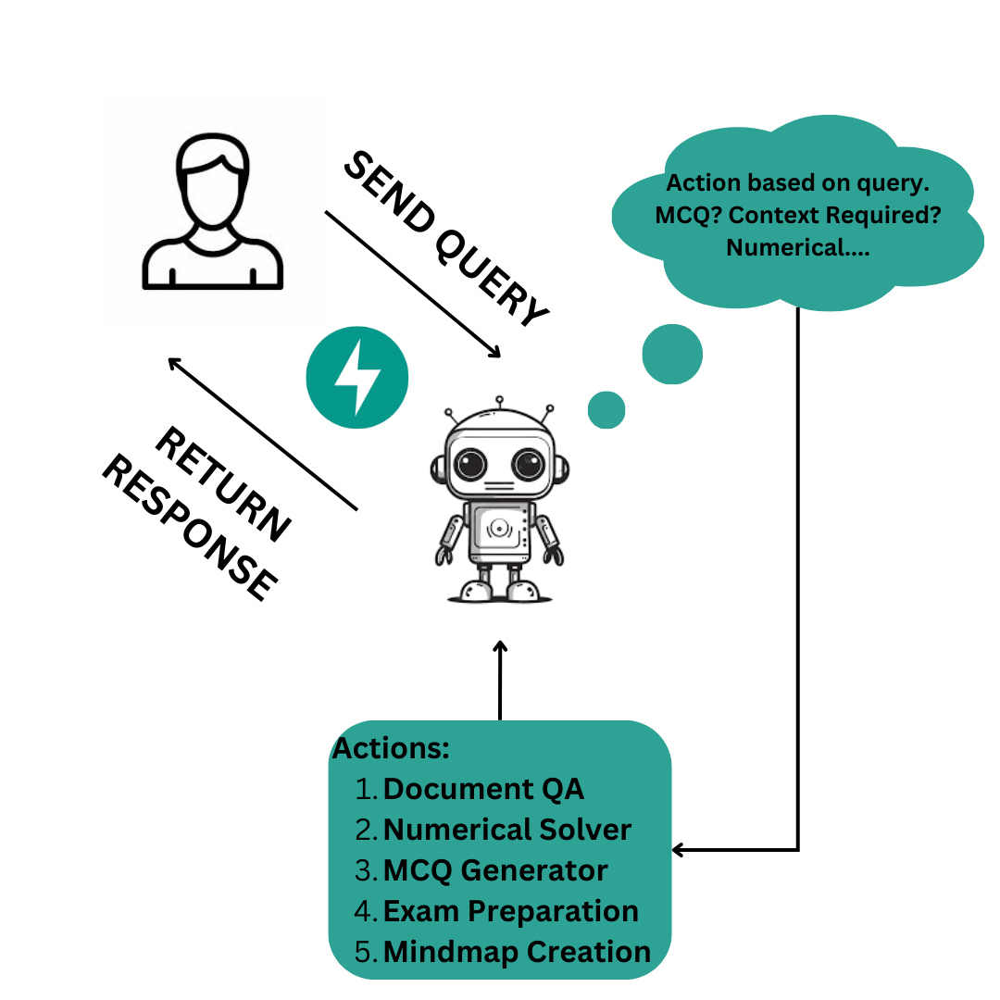

# NCERT AI Bot

NCERT AI Bot is an intelligent agent designed to enhance the learning experience for students using NCERT (National Council of Educational Research and Training) materials. This AI-powered assistant can help with various educational tasks, making studying more interactive and efficient.

## Features

1. **Document Q&A**: Ask questions about any NCERT document, and get accurate answers quickly.
2. **Numerical Problem Solver**: Get step-by-step solutions for chapter numericals.
3. **MCQ Generator**: Create multiple-choice questions based on NCERT content for practice and self-assessment.
4. **Exam Preparation**: Generate additional questions from examples to help you prepare for exams.
5. **Mind Map Creator**: Visualize complex topics with automatically generated mind maps.

## Workflow

</div>

<div align="center">

</div>

## Demo

Check out our demo video to see the NCERT AI Bot in action:


## Getting Started

Ensure you have the necessary hardware:
   - A GPU is required to run the bot efficiently. A T4 GPU will suffice.

1. Clone the repository:
   ```
   https://github.com/Koosh0610/sarvam-hiring-task.git
   ```

2. Change to the project directory:
   ```
   cd sarvam-hiring-task
   ```

3. Install Python dependencies:
   ```
   pip install -r requirements.txt
   ```

4. Install system dependencies:
   ```
   sudo apt install $(cat packages.txt)
   ```

5. Set up the Groq API key:
   - Sign up for a Groq API key at [https://console.groq.com/](https://console.groq.com/)
   - Create a `.env` file in the project root directory
   - Add your Groq API key to the `.env` file:
     ```
     GROQ_API_KEY = your_api_key_here
     OPENAI_API_KEY = same_as_groq_api_key
     ```

6. Run the NCERT AI Bot:
   ```
   python fastapi_server.py & streamlit run streamlit_app.py
   ```

We hope the NCERT AI Bot helps enhance your learning experience. Happy studying!
